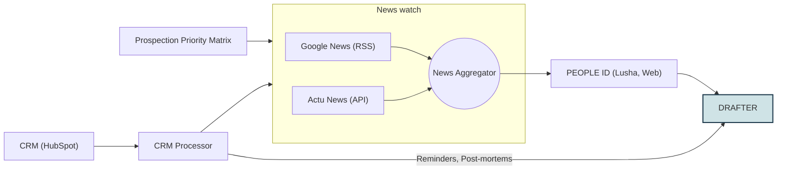

# Emerton BD Watch — Hackathon skills

This folder is the home for the **skills built during the Emerton hackathon**. The project,
`bd-watch`, is a Business Development watch-and-outreach assistant: it spots a reason to reach out,
finds the right person, drafts the message, and gates it for human review. Each stage was built by a
different teammate as its own skill/module; together they form one pipeline:

```
Watch → Qualify → Contact → Draft → Review
 (why now?)  (worth it?)  (who?)   (write)  (safe to send?)
```

## Functional architecture



> The diagram above reproduces the team's functional architecture. (To embed the original PNG instead,
> drop it in as `skills/architecture.png` and replace this block with ``.)

**How the architecture maps to the skills, and the two ways work reaches the Drafter:**

- **Discovery path (cold prospects).** The **Prospection Priority Matrix** (skill 02 — Qualify) scopes
  *who and what is worth watching*; the **News watch** (skill 01 — Google News RSS + Actu News API → a
  **News Aggregator**) surfaces the reason to reach out; **PEOPLE ID** (skill 03 — Lusha + web) resolves
  the right person; the **Drafter** (skill 04) writes the message. → feeds the drafter's **new-prospects** input.
- **CRM path (existing relationships).** **CRM (HubSpot) → CRM Processor** is realized by three packaged
  **CRM routines** that pull live HubSpot data and produce the spreadsheets the rest of the pipeline
  consumes: `crm-reminders-routine` → deal reminders (drafter's **known-clients** input),
  `crm-post-mortem-routine` → `Lost_Deals_PostMortem.xlsx` (drafter's **lost-deals** input), and
  `crm-prospects-for-news-screening` → a never-won prospect list cross-referenced with news, feeding the
  discovery path.
- **Review** (skill 05) is the internal send-gate after the Drafter — a guardrail, not a functional block,
  so it isn't drawn above.

> **Packaging status.** Six skills are now packaged as installable Claude Skills:
> the **orchestrator** (`emerton-bd-orchestrator`), the **signal watch** (`emerton-signal-watch`, Watch +
> Qualify), the **message drafter** (`emerton-message-drafter`), and three **CRM ingestion routines** that
> pull live data from HubSpot — `crm-reminders-routine`, `crm-post-mortem-routine`, and
> `crm-prospects-for-news-screening`. The remaining stage, **Contact identification (03)**, is merged on
> `main` as a Python module but its pipeline hook still returns a mock profile (wiring pending), and Review
> is a base step. This index documents all of them so the team has one place to see what exists and its state.

## The skills at a glance

| # | Skill | Architecture block | What it does | Owner | Lives in | Status |
|---|-------|--------------------|--------------|-------|----------|--------|
| 00 | **Orchestrator** 🎯 | (drives the whole flow) | Single entry point: runs the full pipeline end to end (CRM path & discovery path), composes the sub-skills, applies the Review gate, and consolidates one review document + run report. | Loïc | **`emerton-bd-orchestrator/`** (packaged `.skill`) | ✅ Packaged & merged to `main` |
| 01 | **Watch / Triggers** | Google News (RSS) + Actu News (API) → News Aggregator | Scans news sources (nominations, appointments, funding) for reasons to reach out and aggregates them into raw signals/triggers. | Benjamin | `triggers_module/`, `src/bd_watch/scrapers/`, `steps/step01_watch.py` — **packaged with Qualify in `emerton-signal-watch/`** | ✅ Packaged (`emerton-signal-watch`); RSS live |
| 02 | **Qualify / Targeting matrix** ⭐ | Prospection Priority Matrix | Scopes & prioritises *what is worth watching* and scores triggers on the 3-axis matrix (sector × geography × function → P1–P3, worst-axis rule + P1-sector bypass). | Benjamin | `steps/step02_qualify.py` + `targeting_matrix.json` — **packaged in `emerton-signal-watch/`** | ✅ Packaged & matrix scoring live |
| 03 | **Contact identification** | PEOPLE ID (Lusha, Web) | From a signal, deduces the target profile, finds candidates via **Lusha + web scraping**, ranks them with an LLM, enriches the top 3; checks CRM first for existing relationships. | team | `src/bd_watch/identify_contact/` (module) + `steps/step03_contact.py` (hook) | Module merged; **pipeline hook still returns a mock** — wiring pending |
| C1 | **CRM reminders routine** | CRM (HubSpot) → CRM Processor | Pulls stale early-stage HubSpot deals (no update in ~1 week), scores them on a 4-tier rubric, writes a prioritised deal-reminders `.xlsx` → the drafter's **known-clients** input. | Ugo | **`crm-reminders-routine.skill`** | ✅ Packaged |
| C2 | **CRM post-mortem routine** | CRM (HubSpot) → CRM Processor | Pulls **lost** deals from HubSpot and writes `Lost_Deals_PostMortem_[date].xlsx` → the drafter's **lost-deals** input. | Ugo | **`crm-post-mortem-routine.skill`** | ✅ Packaged |
| C3 | **CRM prospects → news screening** | CRM (HubSpot) → CRM Processor → News watch | Maintains `Never_Won_Prospects.xlsx` (prospected-but-never-won companies) and cross-references it with news signals to spot re-engagement windows → feeds the **discovery** path. | Ugo | **`crm-prospects-for-news-screening.skill`** | ✅ Packaged |
| 04 | **Message drafter** ⭐ | DRAFTER | Turns an Excel of contacts into review-ready outreach — one email + one 1-to-1 LinkedIn per contact, email-ready, grounded strictly in the row. | Loïc | **`emerton-message-drafter/`** (packaged `.skill`) | ✅ Packaged & merged to `main` |
| 05 | **Review** | (internal gate, not shown) | Guardrail: auto-send only if confidence is high and no flags; otherwise route to human review or discard. | team | `steps/step05_review.py` | Merged; minimal rule in place |

Data flows through the shared typed contracts in `src/bd_watch/schemas.py`, so each skill can be built
and run independently. `src/bd_watch/pipeline.py` wires them end to end.

---

## 00 — Orchestrator 🎯  ·  packaged Claude Skill

The single entry point that **runs the whole pipeline** and returns one consolidated review document +
run report. It picks the path (**CRM** = Excel → Draft → Review, working today; **discovery** = Watch →
Qualify → Contact → Draft → Review), runs each available stage through the shared `schemas.py` contracts,
**delegates drafting to `emerton-message-drafter`** (never re-implements it), applies the Review gate, and
degrades gracefully — flagging the mocked contact hook (`contact_unverified`) and never fabricating to fill
a gap. **→ [`emerton-bd-orchestrator/README.md`](emerton-bd-orchestrator/README.md)**
· stage contracts & availability in [`emerton-bd-orchestrator/references/pipeline.md`](emerton-bd-orchestrator/references/pipeline.md).

## 01 — Watch / Triggers  ·  *packaged in `emerton-signal-watch`*

Detects *why now*. A standalone CLI (`triggers_module/nominations_scraper.py`) fetches nomination and
appointment news from **Google News (RSS)** (broad French/English queries in `targeting_config.yaml`,
filtered post-fetch on target roles) plus an **Actu News (API)** feed, with additional `scrapers/` for
press and MergerMarket. A **News Aggregator** merges and de-duplicates these into `RawSignal`s for the
next stage; scoring is intentionally **not** done here (that's Qualify).

## 02 — Qualify / Targeting matrix

Decides *is it worth it*. Scores each trigger on Emerton's three axes — functional/offer, sector, and
geography — to a P1–P3 priority, and filters out the noise. The matrix lives in `targeting_matrix.json`
(and `targeting_config.yaml`); `steps/step02_qualify.py` applies it (global score = worst axis, with a
P1 sector always scoring 1.0).

**Watch + Qualify are packaged together as one installable Claude Skill: [`emerton-signal-watch`](emerton-signal-watch/README.md).**
It scrapes nominations/press and returns the qualified, scored signals (JSON/text) — no LLM, no API key.
Install: in Claude desktop / Cowork → **Customize → Skills → "+"**, upload
[`emerton-signal-watch.skill`](emerton-signal-watch.skill). It stops at the qualified watchlist and hands
off to the contact + drafter skills.

## 03 — Contact identification  ·  *module merged on `main` (hook not yet wired)*

Decides *who to address*. `src/bd_watch/identify_contact/` is a full module:
`signal → deduce target profile → candidates (Lusha + web scraping) → LLM ranking → enrich top 3`, with a
CRM check first so an existing/dormant relationship is reactivated rather than treated as cold. Produces
a `ContactProfile` for the drafter. **Note:** the pipeline hook `steps/step03_contact.py` still returns a
placeholder profile — wiring it to this module is the main remaining gap on the discovery path.

## C1–C3 — CRM ingestion routines  ·  packaged Claude Skills (HubSpot)

The **CRM Processor** is realized by three packaged routines (owner: Ugo) that read live HubSpot data and
write the spreadsheets the rest of the pipeline consumes. They run as standalone Cowork skills (and pair
naturally with scheduled tasks for a weekly cadence):

- **`crm-reminders-routine`** — pulls stale early-stage deals (no update in ~1 week), scores them on a
  4-tier priority rubric, and writes a prioritised deal-reminders `.xlsx`. → drafter's **known-clients** input.
- **`crm-post-mortem-routine`** — pulls **lost** deals and writes `Lost_Deals_PostMortem_[date].xlsx`.
  → drafter's **lost-deals** input.
- **`crm-prospects-for-news-screening`** — maintains `Never_Won_Prospects.xlsx` (companies prospected but
  never won) and cross-references them with news signals to spot re-engagement windows. → feeds the
  **discovery** path / news watch.

Install each like any skill: **Customize → Skills → "+"** and upload the `.skill`. The orchestrator can
trigger the relevant routine at the start of a run, then hand the resulting spreadsheet to the drafter.

## 04 — Message drafter ⭐  ·  packaged Claude Skill

Writes the message. This is the one packaged, installable Claude Skill. It takes a contact (plus the
trigger/row context) and produces a review-ready email + LinkedIn message in Emerton's formal register,
grounded strictly in the facts, and **never sends**.

**→ Full documentation: [`emerton-message-drafter/README.md`](emerton-message-drafter/README.md)**
— install steps, usage, the three input shapes (known clients / new prospects / lost-deal post-mortems),
the email-ready output format, the binding `drafting_rules.md`, and all the non-negotiable warnings
(no fabrication, perspective discipline, never mention a lost deal, sender supplied each run, etc.).

Install: in Claude desktop / Cowork → **Customize → Skills → "+"**, upload
[`emerton-message-drafter.skill`](emerton-message-drafter.skill).

## 05 — Review

The safety gate. `steps/step05_review.py` auto-sends only when the draft's confidence is `high` and there
are no flags; everything else is routed to human review (or discarded). In practice nothing auto-sends —
the drafter always returns a review document.

---

## For the team — consolidating onto `main`

- Six skills are packaged on `main`: the orchestrator, the signal watch (Watch + Qualify), the message
  drafter, and the three CRM routines (reminders, post-mortem, prospects-for-news-screening). The **Contact
  module** is merged too, but its pipeline hook (`steps/step03_contact.py`) still returns a placeholder —
  wiring it to `identify_contact` is the main remaining gap. Review lives on `main` as a base pipeline step.
- Keep the **shared contracts** in `src/bd_watch/schemas.py` stable — they are what let these skills stay
  independent and plug together.
- As each stage matures, it can follow the drafter's pattern and be packaged as its own installable
  `.skill` (a folder with `SKILL.md` + `references/` + `scripts/`, zipped with a `.skill` extension).
